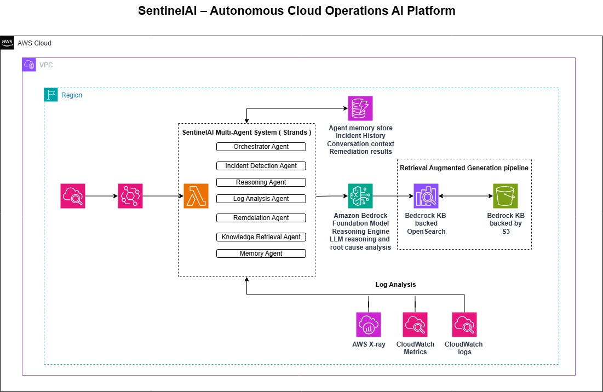
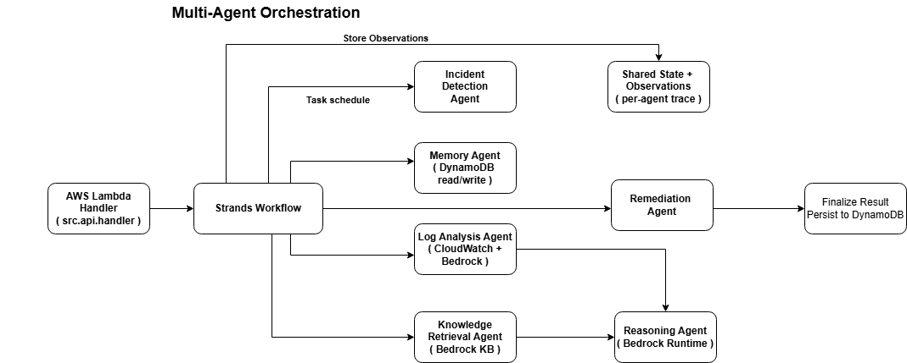
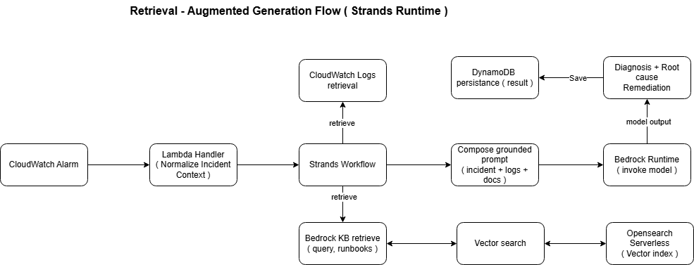
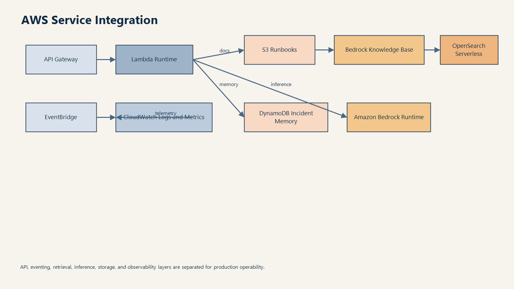

# SentinelAI AWS Agent

SentinelAI AWS Agent is a **hackathon MVP** for an event-driven, multi-agent AWS incident response assistant. It listens for operational incidents, pulls evidence from logs, grounds reasoning with Bedrock Knowledge Bases, and produces root-cause analysis plus remediation guidance.

> This repository is intended for demo and learning purposes. It is **not production-ready** and does not claim production hardening.

## Project overview

The platform is built for engineers who need faster incident triage in AWS environments. A CloudWatch alarm or API request enters a Lambda-based agent runtime. The runtime coordinates specialist agents for incident detection, memory lookups, log analysis, knowledge retrieval, reasoning, and remediation.

## Exact runtime flow (current implementation)

### Entry paths
1. **Event-driven**: CloudWatch Alarm -> EventBridge -> Lambda handler (`src/api/handler.py`)
2. **Request-driven**: API Gateway `POST /incidents` -> Lambda handler (`src/api/handler.py`)

### Agent execution order
In `build_application()` (`src/app.py`), agents are configured in this order:
1. IncidentDetectionAgent
2. MemoryAgent
3. LogAnalysisAgent
4. KnowledgeRetrievalAgent
5. ReasoningAgent
6. RemediationAgent

### Sequential vs parallel
- **Current behavior:** all agents execute **sequentially** in `StrandsWorkflow.execute()` (`src/strands_runtime.py`).
- **Parallel behavior today:** none at agent level.
- **Future optimization idea:** run memory/log retrieval/KB retrieval in parallel before reasoning.

## Agent types: AI agents vs non-LLM workers

| Agent | Type | Uses LLM at runtime? | Role |
|---|---|---|---|
| IncidentDetectionAgent | Worker | No | Normalize incident payload |
| MemoryAgent | Worker | No | Fetch/save incident history |
| LogAnalysisAgent | AI agent | Yes (Bedrock) | Summarize log failure signals |
| KnowledgeRetrievalAgent | Worker | No (retrieval API only) | Retrieve runbooks from KB |
| ReasoningAgent | AI agent | Yes (Bedrock) | Infer diagnosis/root cause/confidence |
| RemediationAgent | Worker | No | Build remediation checklist |

## Hackathon problem definition and impact

- **Problem:** On-call engineers lose time during incidents correlating logs, alarms, and runbooks under pressure.
- **Target users:** SRE, DevOps, and platform teams operating AWS workloads.
- **Expected impact:** Faster triage and more consistent remediation recommendations, improving Mean Time To Resolution (MTTR).
- **Why this is a real use case:** It addresses operational reliability workflows used by production engineering teams, not a toy/demo-only use case.

## What GenAI does vs deterministic system logic

- **GenAI responsibilities (Amazon Bedrock):**
  - Summarize operational log evidence (`LogAnalysisAgent`).
  - Infer likely root cause and confidence (`ReasoningAgent`).
- **Deterministic responsibilities (application logic):**
  - Event normalization and orchestration (`IncidentContext`, `AgentGraph`).
  - Retrieval and persistence workflows (CloudWatch, Bedrock KB, DynamoDB adapters).
  - API transport, response formatting, and UI approvals workflow.

This separation is designed to keep the workflow explainable while still using LLM reasoning where it provides the highest value.

## Architecture diagram







<!--  -->

## Multi-agent system explanation

- The Orchestrator Agent coordinates the workflow and consolidates the final response.
- The Incident Detection Agent normalizes CloudWatch or API payloads into a single incident schema.
- The Log Analysis Agent pulls CloudWatch evidence and summarizes failure modes with Bedrock.
- The Knowledge Retrieval Agent queries a Bedrock Knowledge Base populated from S3 runbooks.
- The Reasoning Agent combines logs, runbooks, and incident metadata to infer root cause.
- The Remediation Agent generates operator-safe mitigation and hardening recommendations.
- The Memory Agent stores and retrieves prior investigations from DynamoDB.

## RAG pipeline explanation

1. Receive an alarm or user request.
2. Retrieve recent CloudWatch logs.
3. Retrieve runbooks from Bedrock Knowledge Base.
4. Merge evidence and context into a reasoning prompt.
5. Invoke a Bedrock foundation model.
6. Return a diagnosis, root-cause explanation, confidence score, and remediation plan.

## Technology stack

- Python 3.12 runtime for the Lambda service
- AWS Lambda, API Gateway, EventBridge, CloudWatch, DynamoDB, S3, IAM
- Amazon Bedrock for inference
- Bedrock Knowledge Base plus OpenSearch Serverless for retrieval
- Terraform for infrastructure provisioning
- Strands-compatible agent orchestration pattern
- Streamlit UI for response review and remediation approvals

## Cost considerations (hackathon view)

### If idle (deployed, no traffic)
- No meaningful Lambda/API per-request cost when there are no invocations.
- Ongoing baseline cost may still exist from provisioned/storage resources, especially:
  - OpenSearch Serverless (for Bedrock Knowledge Base backend)
  - S3 storage
  - DynamoDB storage
  - CloudWatch log storage

### If active (during demo/investigations)
Main cost drivers are:
- Bedrock model inference (LogAnalysisAgent + ReasoningAgent)
- Bedrock Knowledge Base retrieval requests
- Lambda invocation duration and memory
- API Gateway requests
- CloudWatch log queries (`FilterLogEvents`)

### Practical way to estimate
1. Define expected demo load (incidents/hour, average logs/documents, average token usage).
2. Use AWS Pricing Calculator for Lambda, API Gateway, Bedrock, OpenSearch Serverless, S3, DynamoDB.
3. Validate with CloudWatch usage metrics after a test run.

For hackathon judging, you can present cost as **low at idle in local mode**, with active cost mostly driven by Bedrock usage.

## Setup instructions

```bash
git clone <your-repo-url>
cd sentinelai-aws-agent
python -m venv .venv
source .venv/bin/activate
pip install -r requirements.txt
```

Set environment variables as needed:

```bash
export AWS_REGION=us-east-1
export BEDROCK_MODEL_ID=anthropic.claude-3-5-sonnet-20241022-v2:0
export BEDROCK_INFERENCE_PROFILE_ID=<optional-inference-profile-id>
export BEDROCK_KNOWLEDGE_BASE_ID=<knowledge-base-id>
export INCIDENTS_TABLE=<dynamodb-table-name>
```

If your selected Bedrock model requires an inference profile for live invocation, set `BEDROCK_INFERENCE_PROFILE_ID`. When set, it is used instead of `BEDROCK_MODEL_ID`.

### Environment variable defaults

Defaults are defined in `src/config.py`.

| Variable | Default |
|---|---|
| `AWS_REGION` | `us-east-1` |
| `BEDROCK_MODEL_ID` | `anthropic.claude-3-5-sonnet-20241022-v2:0` |
| `BEDROCK_INFERENCE_PROFILE_ID` | `""` (empty) |
| `BEDROCK_KNOWLEDGE_BASE_ID` | `""` (empty) |
| `KNOWLEDGE_BUCKET` | `""` (empty) |
| `INCIDENTS_TABLE` | `sentinelai-aws-agent-incidents` |
| `LOG_GROUP_NAME` | `/aws/lambda/sentinelai-aws-agent` |
| `API_STAGE` | `prod` |
| `APP_ENV` | `local` |
| `ENABLE_AUTO_REMEDIATION` | `false` |
| `MAX_LOG_EVENTS` | `50` |
| `MAX_DOCUMENTS` | `5` |

## Infrastructure deployment steps

```bash
./scripts/deploy.sh hackathon us-east-1
```

The Terraform stack provisions:

- S3 bucket for runbooks
- DynamoDB table for memory
- Lambda service for agent execution
- HTTP API Gateway endpoint
- EventBridge rule for CloudWatch alarms
- IAM roles with scoped access
- Bedrock Knowledge Base backed by OpenSearch Serverless

## Running the system locally

You can invoke the sample incident locally once Python is available:

```bash
python -m src.api.handler
```

Or run with a custom event file:

```bash
python -m src.api.handler --event-file evaluation/custom_event.json
```

### Local profile (full UI flow without AWS)

This mode runs both backend and static UI locally so all UI capabilities work end-to-end.

```powershell
./scripts/run_local_profile.ps1
```

URLs:

- Web UI: `http://localhost:8084`
- Local API: `http://localhost:9000`

The static UI now runs in local mode by default and auto-configures:

- Incident API: `http://localhost:9000`
- Approvals API: `http://localhost:9000/approvals`

Local approval records are persisted to `data/approvals_api.json`.

## UI for responses and approvals

Run the local dashboard:

```bash
streamlit run src/ui/dashboard.py
```

The UI provides:

- Incident event input and one-click investigation execution
- Investigation response view including diagnosis, root cause, and confidence
- Per-step remediation approvals with approve, reject, or pending decisions
- Stored approval history persisted to `data/approvals.json`

## Lightweight S3 web app

A static lightweight web app is available in `webapp/` for S3 hosting.

Deploy it to S3 (PowerShell):

```powershell
./scripts/deploy_webapp_s3.ps1 -BucketName <your-ui-bucket> -ApiBaseUrl <api-endpoint> -Region us-east-1 -PublicRead
```

This script:

- Copies static files from `webapp/`
- Injects the backend API endpoint into `config.js`
- Syncs files to your S3 bucket
- Configures S3 static website hosting
- Optionally enables public read for demo usage

See `docs/s3-webapp.md` for full details.

## Example incident investigation

Sample incident input:

```json
{
  "source": "aws.cloudwatch",
  "detail-type": "CloudWatch Alarm State Change",
  "detail": {
    "alarmName": "HighApi5xxRate",
    "severity": "SEV2",
    "description": "API Gateway 5xx error rate exceeded threshold",
    "state": {
      "value": "ALARM",
      "reason": "5xx error rate exceeded 5% for 5 minutes"
    },
    "logGroupName": "/aws/lambda/sentinelai-aws-agent"
  }
}
```

## Example API request

```bash
curl -X POST "$API_ENDPOINT/incidents" \
  -H "Content-Type: application/json" \
  -d @evaluation/api_request.json
```

## Demo validation checklist

Use this exact payload for judging demos:

`evaluation/api_request.json`

Expected output checks:

- Response contains: `incident`, `diagnosis`, `probable_root_cause`, `confidence`, `remediation_plan`.
- Response contains `dependency_status` with:
  - `cloudwatch_logs`
  - `bedrock_runtime`
  - `bedrock_knowledge_base`
  - `overall_mode`
- UI shows execution mode (`live` or `fallback`) in the Investigation Response card.
- If any dependency fails, fallback mode is visible instead of hidden.

For a full presentation flow, see: `docs/hackathon-demo-runbook.md`
For judge Q&A preparation, see: `docs/hackathon-judge-qa.md`

## Documentation map

- Architecture overview: `docs/architecture.md`
- Agent design details: `docs/agent-design.md`
- Request/response flow: `docs/request-response-flow.md`
- RAG pipeline notes: `docs/rag-pipeline.md`
- Deployment notes: `docs/deployment.md`
- S3 web app guide: `docs/s3-webapp.md`
- Hackathon demo runbook: `docs/hackathon-demo-runbook.md`
- Hackathon judge Q&A: `docs/hackathon-judge-qa.md`

## Example AI response

```json
{
  "incident": {
    "incident_id": "b0e1d8b2-300a-44a8-9971-fb3e8b7d53aa",
    "source": "aws.cloudwatch",
    "severity": "SEV2",
    "title": "HighApi5xxRate"
  },
  "probable_root_cause": "Database connection saturation amplified by Lambda concurrency",
  "confidence": 0.82,
  "remediation_plan": [
    "Throttle non-critical Lambda concurrency or enable reserved concurrency.",
    "Switch the impacted workload to RDS Proxy or reduce pool size.",
    "Review the most recent deployment and roll back if required."
  ]
}
```

The response also includes a `dependency_status` object showing whether each external dependency ran in `live` or `fallback` mode, plus an `overall_mode` field. This makes demo behavior explicit and transparent.

## Cleanup instructions

```bash
cd infra/terraform
terraform destroy -var="environment=hackathon"
```

## Repository structure

```text
sentinelai-aws-agent/
├── src/
├── infra/terraform/
├── docs/
├── diagrams/
├── evaluation/
├── scripts/
├── requirements.txt
└── README.md
```
