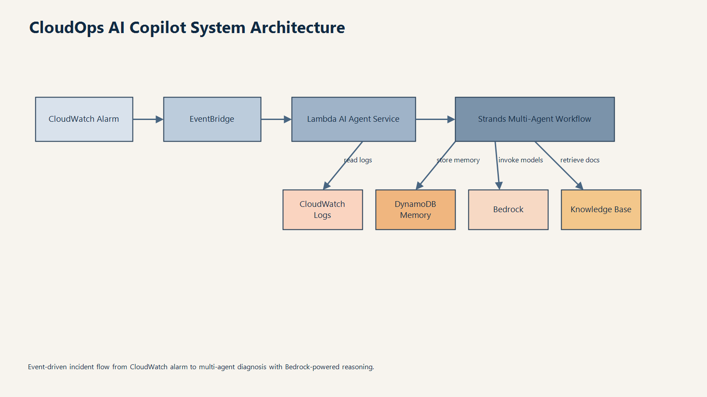
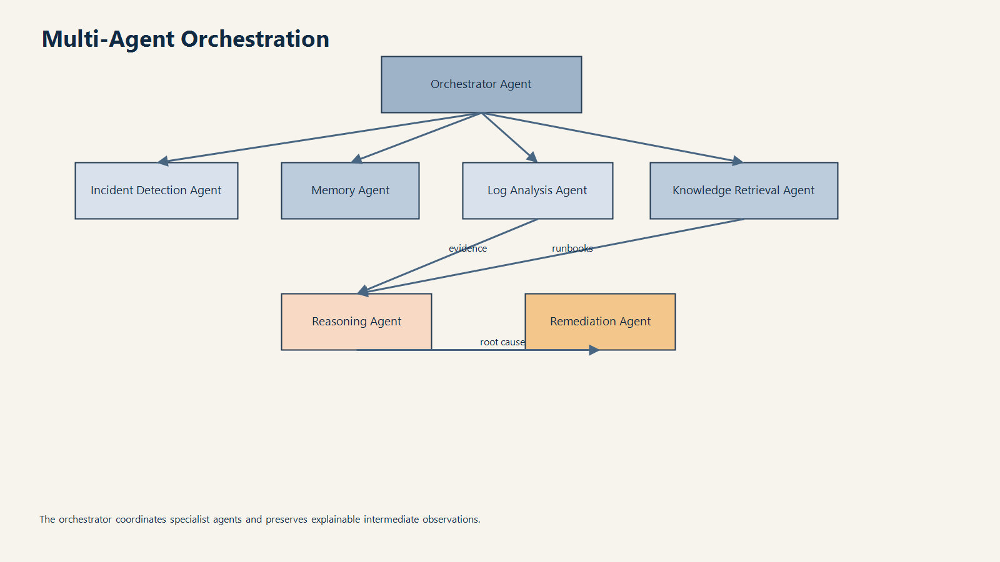
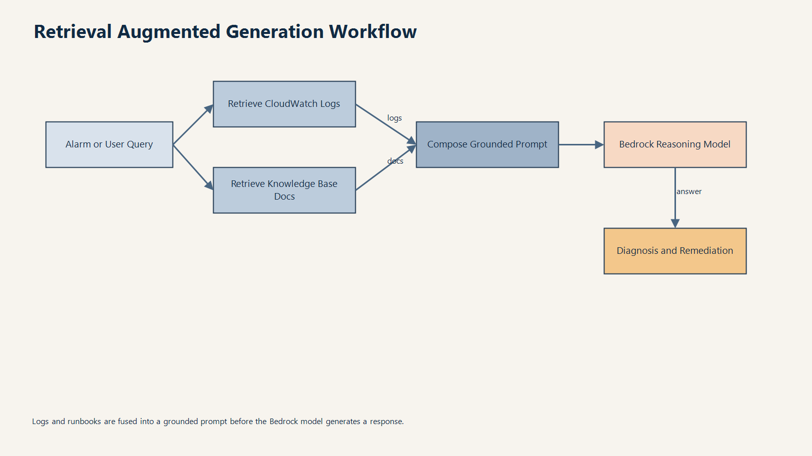

# SentinelAI AWS Agent - Enterprise Presentation

## Slide 1 - Title

### SentinelAI AWS Agent

### Autonomous Incident Diagnosis and Remediation Co-Pilot for Cloud Operations

- Audience: CIO, CTO, VP Engineering, SRE Leadership, Security and Operations teams
- Context: Enterprise-grade AI platform for faster incident triage and safer remediation
- Presenter note: Position this as an augmentation platform for operations teams, not a replacement

---

## Slide 2 - Business Use Case: What Problem Are We Solving?

### Problem Statement

Modern cloud operations teams face:

- High alert volume and noisy alarms
- Slow mean time to detect (MTTD) and mean time to resolve (MTTR)
- Tribal knowledge dependency for root cause analysis
- Inconsistent remediation quality under pressure
- Escalating downtime and incident cost

### What SentinelAI Solves

- Converts alarms into structured investigations automatically
- Correlates logs and runbooks using retrieval-augmented AI
- Produces explainable root-cause hypotheses with confidence
- Suggests remediation actions with human approval workflow
- Builds institutional memory from prior incidents

### Outcome

- Faster recovery, lower operational risk, and predictable incident management

---

## Slide 3 - Real-World Context and Latest Incident Trends

### Why This Is Urgent

Recent global incidents show a common pattern: detection was fast, diagnosis and coordinated remediation were slow.

### Real-World Incident Examples

- CrowdStrike outage (July 2024): broad enterprise endpoint disruption and global service interruption
- Major cloud region incidents (across providers in 2024-2026): dependency cascades from identity, networking, and control plane services
- Large SaaS incidents: prolonged user impact due to delayed correlation between telemetry signals and remediation steps

### Key Observation

- Most organizations have monitoring
- Fewer organizations have autonomous diagnosis + guided remediation at enterprise scale

### Strategic Gap

- Existing tooling is alert-centric
- Enterprise resilience requires decision-centric incident systems

---

## Slide 4 - High-Level Diagram

### Event-Driven AI Incident Flow

### Narrative

1. CloudWatch alarm triggers EventBridge
2. Lambda invokes autonomous multi-agent workflow
3. Agents analyze logs, retrieve knowledge, infer root cause
4. System returns recommendations and captures memory

---

## Slide 5 - Architecture Diagram (Enterprise View)

### Multi-Agent + AWS-Native Integration

### Agent Collaboration View

### RAG Pipeline View

### Architectural Highlights

- Event-driven and serverless for elastic scale
- Bedrock + Knowledge Base for grounded reasoning
- DynamoDB for memory and auditability
- API layer for integrations with portals, bots, ITSM
- Observability-first design with traces and structured logs

---

## Slide 6 - Video Slide (Black Background)

### Demo Video Placeholder

- Slide style: Full black background
- Text (optional, minimal): "Live Incident Walkthrough"
- Purpose: Embed 60-120 second product demo video

### Suggested Demo Sequence

1. Alarm received
2. AI investigation initiated
3. Root cause and confidence displayed
4. Remediation approvals captured
5. Incident summary produced

---

## Slide 7 - Business Value (Cost, Risk, and Productivity)

### Cost Model Example (Illustrative)

Assume:

- 40 P1/P2 incidents per month
- Current MTTR = 120 minutes
- Target MTTR reduction = 30% (36 minutes saved per incident)
- Blended outage cost = $8,000 per hour

Estimated monthly avoided impact:

- Time saved: 40 x 0.6 hours = 24 hours
- Avoided outage cost: 24 x $8,000 = $192,000/month
- Annualized potential impact: $2.3M+

### Additional Value Levers

- Reduced on-call fatigue and burnout
- Faster onboarding for new SRE/DevOps engineers
- Better audit readiness via traceable decisions
- Improved service reliability and customer trust

---

## Slide 8 - Future Scope and Enhancements

### Near-Term Enhancements

- ITSM integration (ServiceNow, Jira) for automated ticket enrichment
- Guardrailed automated remediation runbooks (SSM, Step Functions)
- Team-specific policy engine for approval routing
- Incident postmortem auto-drafting

### Mid-Term Enhancements

- Multi-cloud support with unified incident ontology
- Predictive incident prevention from anomaly trends
- FinOps-aware remediation ranking
- Security incident co-pilot workflows (SOC + SRE collaboration)

### Long-Term Vision

- Autonomous resilience platform with closed-loop operations

---

## Slide 9 - Summary (Striking Close)

### From Alert Fatigue to Autonomous Resilience

SentinelAI AWS Agent transforms incident response from:

- Reactive to proactive
- Manual to AI-assisted
- Tribal to institutional
- Slow to near real-time

### Final Message

- Faster diagnosis
- Safer remediation
- Measurable business value
- Enterprise-ready foundation for autonomous cloud operations

### Closing Tagline

"Every critical minute matters. SentinelAI turns minutes into certainty."

---

## Optional Appendix (If Needed)

### KPI Dashboard to Track Post-Go-Live

- MTTD
- MTTR
- Incident recurrence rate
- Approval cycle time
- Percentage of incidents with AI-assisted diagnosis
- Downtime cost trend
