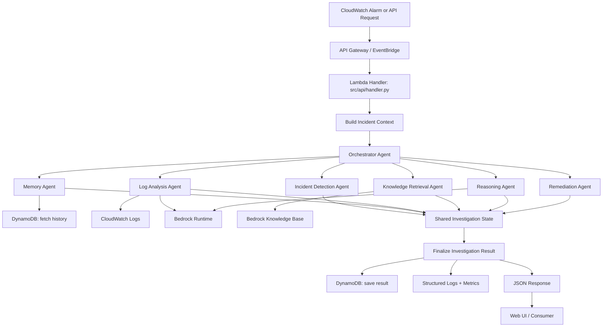

# Request to Response Flow

## Notes

- Entry can be event-driven (CloudWatch -> EventBridge) or request-driven (API Gateway).
- The orchestrator executes agents in sequence and accumulates explainable trace data.
- Response includes diagnosis, probable root cause, remediation plan, confidence, and agent trace.
